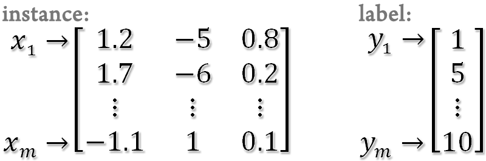
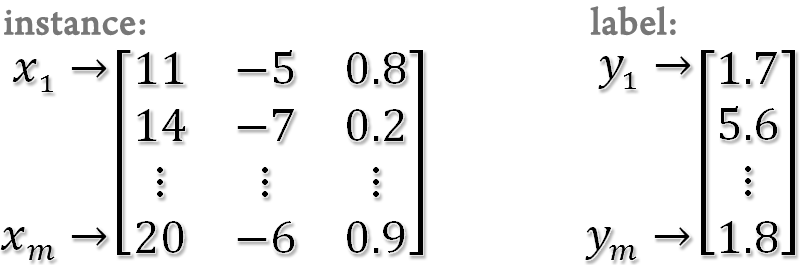

# Kernel Statistics Toolbox

## Introduction
Kernel Statistics toolbox is still in development. Two algorithms are now available. One is kernel principal component analysis (KPCA). The other is kernel sliced inverse regression (KSIR).

## Key Features
* Construct principal components in the input space and feature space.
* Provide a preprocess for preventing ill-posed problem encountered in KSIR.
* Support linear, polynomial and radial basis kernels.
* Can handle large scale problems by using reduced kernel.

## Download KStat Toolbox
* [Matlab implementation](src/KStattoolbox)

## Data Format
Kernel Statistics toolbox is implemented in Matlab. Use a data format which can be loaded into Matlab. The instances are represented by a matrix (rows for instances and columns for variables) and the labels (1,2,...,k) or responses are represented by a column vector. Note that you also can represent the labels of binary classification by 1 or -1.

For classification
<p align="center">
  
</p>

For regression
<p align="center">
  
</p>

## Code Usage
KStat toolbox contains two main functions: KDR for constructing PCs and UseKDR for using the results of KDR. Besides, users also can directly use the two core programs, KPCA and KSIR, for a specific kernel matrix.

Description for codes:

Function| Description 
---- | ----
KDR|the main program for constructing PCs via different methods
UseKDR|using the results of KDR to build up the projected data matrix
KPCA|finds dimension reduction directions by PCA of a kernel matrix
KSIR|finds dimension reduction directions by sliced inverse regression of a kernel matrix

### Usage of KDR
`[Info] = KDR(label, inst, 'options')`

#### Input of KDR:
Variable | Description 
---- | ----
label|training data class label or response
inst|training data inputs

#### Options:
Variable | Description 
---- | ----
-s|statistic method (default: 0)<br/> 0-PCA<br/> 1-SIR
-t|kernel type (default: 2)<br/> 0-linear<br/> 1-polynomial<br/> 2-radial basis (Gaussian kernel)
-r|ratio of random subset size to the full data size (default: 1)
-z|number of slices (default: 0.1)<br/> If NumOfSlice >= 1, it represents NumOfSlice slices.<br/> If NumOfSlice = 0, it extracts slices according to class labels.
-p|number of principal components (default: 1)<br/> If NumOfPc = r >= 1, it extracts the first r leading eigenvectors.<br/> If NumOfPc = r < 1, it extracts leading eigenvectors whose sum of eigenvalues is greater than 100\*r% of the total sum of eigenvalues.
-g|gamma in kernel function (default: 0.1)
-d|degree of polynomial kernel function (default: 2)
-b|constant term of polynomial kernel function (default: 0)
-m|scalar factor of polynomial kernel function (default: 1)

#### Output of KDR:
Variable | Description 
---- | ----
info|results of Kernel Statistics method (a structure in Matlab)
.PC|principal components of data
.EV|eigenvalues respect to the principal components
.Raio|  
.RS|reduced set
.Space|the space of Kernel Statistics method
.Params|parameters specified by the user in the inputs

#### Example:
* Construct ten PCs via KPCA by using Gaussian kernel  
`[Info_one] = KDR([], inst, '-s 0 -t 2 -g 0.1 -p 10');`
* Construct five PCs via reduced KPCA (10%) by using Gaussian kernel  
` [Info_two] = KDR([], inst, '-s 0 -t 2 -p 5 -g 0.2 -r 0.1');`
* Construct PCs of 90% eigenvalue via KPCA by using reduced polynomial kernel  
`[Info_three] = KDR([], inst, '-s 0 -t 1 -p 0.9 -r 0.1 -d 2 -m 3 -b 2');`
* Construct one PCs via KSIR by using Gaussian kernel for 2-class problems  
`[Info_four] = KDR(label, inst, '-s 1 -t 2 -p 1 -z 0 -g 0.3');`
* Construct 5 PCs via KSIR (30 slices) by using Gaussian kernel for regression problemsl  
`[Info_five] = KDR(label, inst, '-s 1 -t 2 -p 1 -z 30 -g 0.2');`

### Usage of UseKDR
`[ProjInst] = UseKDR(inst, Info)`

#### Input of UseKDR:

Variable | Description 
---- | ----
inst|testing data inputs
Info|results of Kernel Statistics method

#### Output of UseKDR:
Variable | Description 
---- | ----
ProjInst|the projected instances

#### Example:
* Get the projected inst form Info_one  
`[ProjInst_one] = UseKDR(inst, Info_one);`
* Get the projected inst form Info_four  
`[ProjInst_four] = UseKDR(inst, Info_four);`

### Usage of KPCA
`[EigenVectors, EigenValues, ratio] = KPCA(K, NumOfPC);`

#### Input of KPCA:
Variable | Description 
---- | ----
K|kernel matrix (reduced or full)
NumOfPC|If NumOfPC= r >= 1, it extracts the first r leading eigenvectors.<br/> If NumOfPC= r < 1, it extracts leading eigenvectors whose sum of eigenvalues is greater than 100\*r% of the total sum of eigenvalues.

#### Output of KPCA:
Variable | Description 
---- | ----
EigenValues|leading eigenvalues
EigenVectors|leading eigenvectors
ratio|sum of leading eigenvalues over total sum of all eigenvalues.

#### Example:
* Construct ten PCs via KPCA by using a specific kernel matrix  
`[EigenVectors, EigenValues, ratio] = KPCA(K, 10);`
* Construct PCs whose ratio to the total sum is 95%  
`[EigenVectors, EigenValues, ratio] = KPCA(K, 0.95);`

### Usage of KSIR
`[EigenVectors, EigenValues, ratio] = KSIR(K, y, NumOfSlice, NumOfPC)`

#### Input of KSIR:
Variable | Description 
---- | ----
K|kernel matrix (reduced or full)
y|class labels or responses
NumOfSlice|If numerical, it represents the number of slices.<br/> If a string 'Class', the number of slices is equal to number of distinct classes in y.
NumOfPC|If NumOfPC= r >= 1, it extracts the first r leading eigenvectors.<br/> If NumOfPC= r < 1, it extracts leading eigenvectors whose sum of eigenvalues is greater than 100\*r% of the total sum of eigenvalues.

#### Output of KSIR:
Variable | Description 
---- | ----
EigenValues|leading eigenvalues
EigenVectors|leading eigenvectors
ratio|sum of leading eigenvalues over total sum of all eigenvalues.

#### Example:
* Construct PCs via KSIR for classification by using a specific kernel matrix  
`[EigenVectors, EigenValues, ratio] = KSIR(K, y, 'CLASS');`
* Construct two PCs via KSIR for 3-class problem  
`[EigenVectors, EigenValues, ratio] = KSIR(K, y, 'CLASS', 2);`
* Construct PCs via KSIR for regression (20 slices)  
`[EigenVectors, EigenValues, ratio] = KSIR(K, y, 20);`
* Construct five PCs via KSIR for regression  
`[EigenVectors, EigenValues, ratio] = KSIR(K, y, 20, 5);`
* Construct PCs whose ratio to the total sum is 95% via KSIR for regression  
`[EigenVectors, EigenValues, ratio] = KSIR(K, y, 20, 0.95);`

### Dimension Reduction Using KPCA or KSIR with Examples

#### KPCA procedure
1. Change your current directory to KStat toolbox folder
2. Load dataset Ionosphere_dataset.mat (can be found in Kernel Statistics toolbox)
  ```
  load Ionosphere_dataset.mat
  ```
3. Construct PCs via KPCA
  ```
  [Info] = KDR([], inst, '-s 0 -t 2 -g 0.1 -p 10');
  ```
4. Read the contents of Info (PCs, eigenvalues, parameters, ...etc)
  ```
   Info
   Info.PC
  ```
5. Get the projected inst form the PCs
  ```
  [ProjInst] = UseKDR(inst, Info);
  ```

#### KSIR procedure for classification
1. Change your current directory to KStat toolbox folder
2. Load dataset Ionosphere_dataset.mat (can be found in Kernel Statistics toolbox)
  ```
  load Ionosphere_dataset.mat
  ```
3. Construct PCs via KSIR (note that we extracts m-1 PCs for m-class problems)
  ```
  [Info] = KDR(label, inst, '-s 1 -t 2 -g 0.165 -z 0 -p 1');
  ```

4. Read the contents of Info (PCs, eigenvalues, parameters, ...etc)
  ```
  Info
  Info.PC
  ```

5. Get the projected inst form the PCs
  ```
  [ProjInst] = UseKDR(inst, Info);
  ```

#### KSIR procedure for regression
1. Change your current directory to Kernel Statistics toolbox folder
2. Load dataset Housing_dataset.txt (can be found in Kernel Statistics toolbox)
  ```
  load Housing_dataset.txt
  ```
3. Split the Housing data into inst and label
  ```
  inst =Housing_dataset(:,1:13);
  label = Housing_dataset(:,14);
  ```

4. Construct PCs via KSIR (note that we usually use 10~30 slices and extracts 3~5 PCs for regression problems)
  ```
  [Info] = KDR(label, inst, '-s 1 -t 2 -g 0.0037 -z 20 -p 5');
  ```
5. Read the contents of Info (PCs, eigenvalues, parameters, ...etc)
  ```
  Info
  Info.PC
  ```
6. Get the projected inst form the PCs
  ```
  [ProjInst] = UseKDR(inst, Info);
  ```
